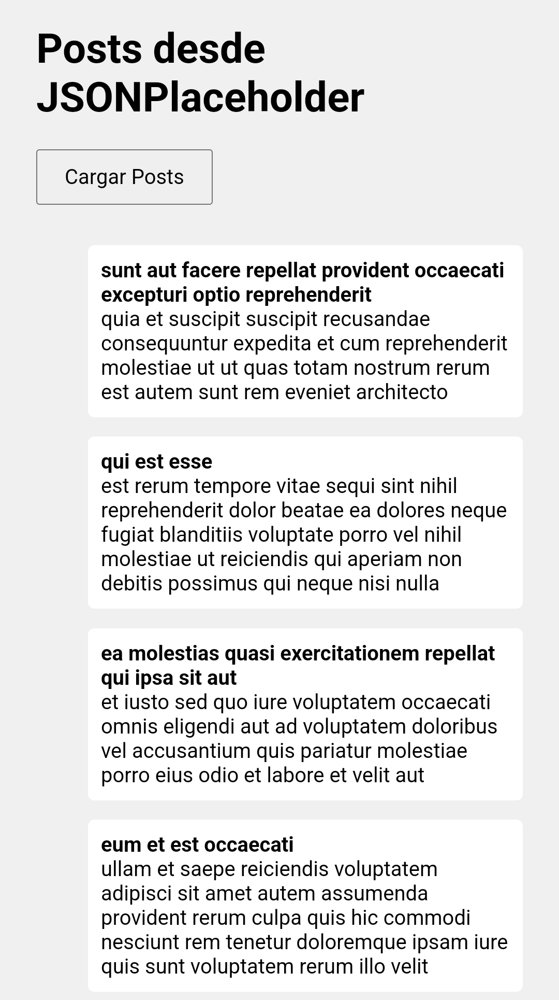

# reto-ajax
Conectar páginas web con APIs públicas. Mostrar datos de forma interactiva.
# Proyecto AJAX con jQuery

Este proyecto muestra cómo usar AJAX con jQuery para obtener datos de una API pública (JSONPlaceholder).

## Archivos

- `ajax.html`: Página principal que incluye el botón para cargar posts.
- `api-request.js`: Script que hace la petición AJAX.
- `styles.css`: Estilos básicos para mejorar la presentación.

## Cómo usar

1. Clona el repositorio.
2. Abre `ajax.html` en tu navegador.
3. Haz clic en “Cargar Posts”.
4. Verás una lista con publicaciones obtenidas de la API.

## Capturas

